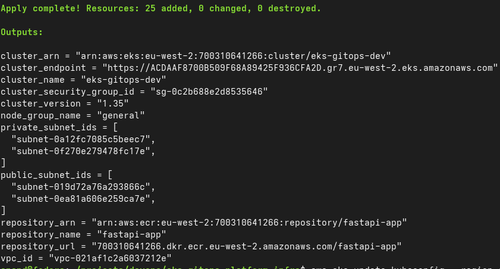
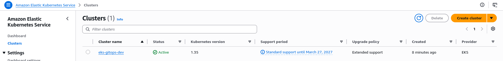
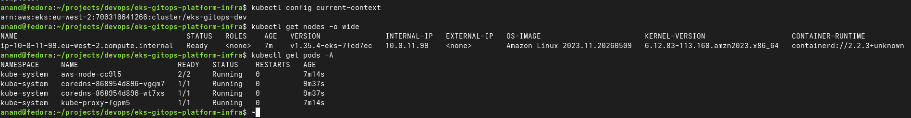
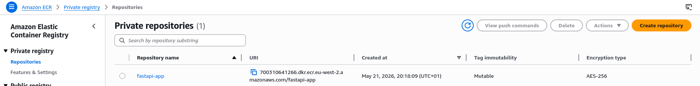

# EKS GitOps Platform Infra

Terraform-based AWS infrastructure for a GitOps platform running on Amazon EKS.

## Overview

This repository provisions the AWS infrastructure for a Kubernetes platform on Amazon EKS, including networking, IAM, container registry, and the Kubernetes control plane.

It is designed to work with a separate application repository that delivers workloads through GitOps using Argo CD.

The platform now supports external application access through AWS Load Balancer Controller and a Kubernetes Ingress resource managed from the application repository. AWS documents the AWS Load Balancer Controller as the EKS-native component for provisioning AWS load balancers from Kubernetes resources, and Argo CD is a declarative GitOps continuous delivery tool for Kubernetes.

## Goals

- Build a production-style AWS EKS platform from scratch.
- Demonstrate Terraform, Kubernetes, GitOps, ingress, and CI/CD skills.
- Create a public portfolio project for DevOps and Platform Engineer roles.
- Show modular infrastructure design, environment separation, and reproducible cloud provisioning.
- Document a clean build, deploy, validate, and destroy workflow.

## Current Status

The platform foundation has been provisioned and validated successfully.

- VPC, subnets, route tables, Internet Gateway, and NAT Gateway created.
- ECR repository created for application images.
- Amazon EKS cluster and managed node group provisioned.
- Cluster access validated with `aws eks update-kubeconfig` and `kubectl`.
- Argo CD installed and syncing workloads from the application repository.
- AWS Load Balancer Controller installed with IRSA and Helm on EKS, following the AWS-recommended installation pattern.
- Application Ingress created successfully through GitOps.
- Public Application Load Balancer provisioned for the sample application.
- Screenshots captured for documentation and portfolio use.

## Platform Flow

This repository owns the cloud infrastructure and cluster foundation.

The paired application repository owns:
- Kubernetes application manifests,
- Kustomize configuration,
- deployment resources,
- service resources,
- and the Ingress resource that creates the external ALB.

End-to-end flow:

```text
Terraform -> AWS VPC / IAM / ECR / EKS
                |
                v
            Amazon EKS
                |
                v
             Argo CD
                |
                v
  eks-gitops-platform-apps repository
                |
                v
Deployment / Service / Ingress
                |
                v
AWS Load Balancer Controller
                |
                v
Public Application Load Balancer
```

## Stack

- Terraform
- AWS VPC
- AWS IAM
- AWS ECR
- AWS EKS
- Argo CD
- Helm
- AWS Load Balancer Controller
- Kubernetes Ingress
- Route 53
- GitHub

## Repository Structure

```text
terraform/          Root Terraform configuration, environments, and reusable modules
bootstrap/          Kubernetes platform bootstrap manifests and add-ons
docs/               Architecture notes, decisions, and screenshots
scripts/            Helper scripts for local workflows
```

## Terraform Layout

```text
terraform/
├── environments/
│   └── dev/
├── modules/
│   ├── vpc/
│   ├── ecr/
│   └── eks/
├── providers.tf
├── variables.tf
├── outputs.tf
└── versions.tf
```

## Implemented Components

### Networking
- Custom VPC for the platform.
- Public and private subnets across multiple Availability Zones.
- Internet Gateway and NAT Gateway for controlled outbound access.
- Route table associations for public and private traffic paths.

### Container Registry
- Amazon ECR repository for application images.
- Image scan on push enabled.

### Kubernetes Platform
- Amazon EKS cluster on Kubernetes 1.35.
- Managed node group for worker nodes.
- Private subnets used for worker nodes.
- Cluster access validated through `kubectl`.

### GitOps Bootstrap
- Argo CD installed in the cluster.
- Application delivery managed from a separate Git repository.
- Continuous reconciliation of desired state into the cluster, which matches the GitOps workflow described by the Argo CD project.

### External Access
- AWS Load Balancer Controller installed using Helm and IAM Roles for Service Accounts.
- Kubernetes Ingress resource used to provision an internet-facing ALB for the sample application.
- External access path designed to support Route 53 DNS integration and future TLS with ACM. AWS Route 53 supports alias records to ELB load balancers.[web:574][web:740]

## Screenshots

### Terraform apply


### EKS cluster ready


### Kubernetes nodes


### ECR repository


## Validation Performed

The following checks were completed after provisioning and platform bootstrap:

- Terraform `init`, `fmt`, `validate`, and `plan`.
- Terraform `apply` completed successfully.
- AWS CLI kubeconfig updated for the EKS cluster.
- `kubectl get nodes -o wide` confirmed node readiness.
- `kubectl get pods -A` confirmed core system pods were running.
- Argo CD application sync confirmed desired state was applied successfully.
- AWS Load Balancer Controller health validated after deployment.
- Kubernetes Ingress reconciled successfully and produced a public ALB endpoint.

## Roadmap

- [x] Bootstrap repository structure
- [x] Add Terraform version and provider constraints
- [x] Provision VPC and networking
- [x] Provision ECR
- [x] Provision EKS cluster
- [x] Validate cluster access with kubectl
- [x] Capture deployment screenshots
- [x] Bootstrap Argo CD
- [x] Connect application delivery repository
- [x] Add AWS Load Balancer Controller
- [x] Add application ingress and public ALB exposure
- [ ] Add Route 53 alias record for `app.anandcloud.com`
- [ ] Add TLS with ACM
- [ ] Add cert-manager or document ACM-only strategy
- [ ] Document end-to-end deployment flow with diagrams
- [ ] Add CI/CD checks for Terraform formatting and validation
- [ ] Add ExternalDNS for automated DNS management

## Design Notes

This project is intentionally structured as a modular Terraform repository instead of a single flat configuration.

Current design choices include:
- reusable modules for VPC, ECR, and EKS;
- environment-specific configuration under `terraform/environments/dev`;
- managed node groups for simpler lifecycle management;
- image registry provisioning separated from cluster provisioning;
- Argo CD used for application delivery rather than mixing workload manifests into Terraform;
- AWS Load Balancer Controller used for EKS-native ingress to AWS;
- documentation and screenshots stored alongside the infrastructure code for portfolio visibility.

## Usage

### Prerequisites
- Terraform installed
- AWS CLI installed and configured
- `kubectl` installed
- `helm` installed
- `eksctl` installed
- AWS credentials configured locally

### Example workflow

```bash
terraform -chdir=terraform/environments/dev init
terraform -chdir=terraform/environments/dev fmt -recursive
terraform -chdir=terraform/environments/dev validate
terraform -chdir=terraform/environments/dev plan -var-file=terraform.tfvars
terraform -chdir=terraform/environments/dev apply -var-file=terraform.tfvars
```

### Configure kubectl for EKS

```bash
aws eks update-kubeconfig --region eu-west-2 --name eks-gitops-dev
kubectl get nodes -o wide
kubectl get pods -A
```

### Install AWS Load Balancer Controller

AWS recommends installing AWS Load Balancer Controller on EKS with Helm and using IAM Roles for Service Accounts.

Typical flow:

```bash
eksctl utils associate-iam-oidc-provider \
  --region eu-west-2 \
  --cluster eks-gitops-dev \
  --approve

eksctl create iamserviceaccount \
  --region eu-west-2 \
  --cluster eks-gitops-dev \
  --namespace kube-system \
  --name aws-load-balancer-controller \
  --attach-policy-arn arn:aws:iam::<account-id>:policy/AWSLoadBalancerControllerIAMPolicy \
  --override-existing-serviceaccounts \
  --approve

helm repo add eks https://aws.github.io/eks-charts
helm repo update

helm install aws-load-balancer-controller eks/aws-load-balancer-controller \
  -n kube-system \
  --set clusterName=eks-gitops-dev \
  --set serviceAccount.create=false \
  --set serviceAccount.name=aws-load-balancer-controller
```

### Teardown Notes

To avoid orphaned load balancers during cluster destroy:
1. remove the application Ingress from the GitOps repository;
2. let Argo CD sync and delete the Ingress;
3. wait for the ALB to be removed from AWS;
4. then destroy the EKS infrastructure.

This project uses that destroy order intentionally because ingress-managed AWS resources can otherwise outlive the cluster and complicate teardown.

## Related Repository

Application repository: [eks-gitops-platform-apps](https://github.com/Anandprakashh/eks-gitops-platform-apps)

## Portfolio Purpose

This repository is part of a hands-on DevOps and platform engineering portfolio focused on:
- infrastructure as code;
- Kubernetes platform setup on AWS;
- GitOps-based delivery patterns;
- cloud-native ingress and load balancer management;
- practical cloud architecture and operational workflows.

It is being built as a real project, with build, validate, expose, and destroy steps documented clearly for interview and portfolio use.